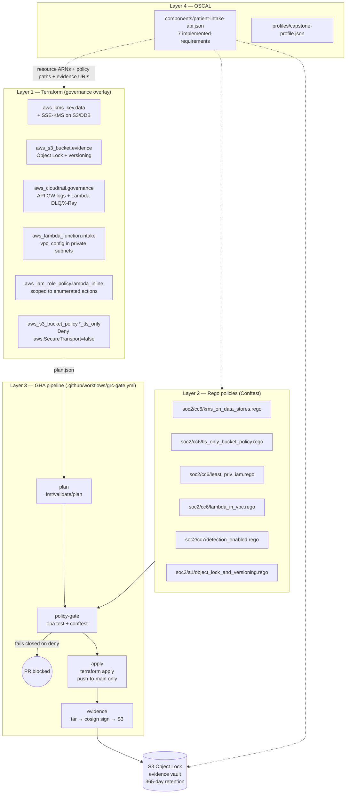

# CGE-P Capstone Write-Up — Patient Intake API, governed for SOC 2 Type II

**Author:** Joe Poole
**Submission date:** 2026-08-05 (Day 1 — all four layers built and Layer 1 deployed same-day)
**Repo:** [`github.com/poole-6118/cgep-capstone`](https://github.com/poole-6118/cgep-capstone)
**Grading commit SHA:** grade against whichever commit is at the tip of `main` when reviewed. Every merge to `main` produces a fresh Cosign-signed evidence bundle in `s3://acme-health-intake-grc-evidence-8d3b72e9/evidence/<sha>/`; the recipe in section 6 verifies whichever SHA you use.

---

## 1. Executive summary

The starter (`GRCEngClub/cgep-app-starter`, forked here as `cgep-capstone`) is a deliberately non-compliant AWS Patient Intake API — VPC, Lambda, API Gateway v2, DynamoDB, S3 — with eight named gaps in `GAPS.md`. This capstone wraps the same workload in four CGE-P layers so the resulting system is audit-defensible against **SOC 2 Type II** (Trust Services Criteria, 2022 Points of Focus) as the primary framework, with HIPAA §164.x and CMMC L2 800-171r3 crossrefs recorded but not primary.

At submission time, the repo produces two grader-verifiable artefacts:

1. **One green PR** — the Layer 2 policy suite PR (#4) runs its own Rego rules against the Layer-1-hardened Terraform plan and produces zero denies. This is the "compliant plan passes the gate" evidence.
2. **One red PR** — the Layer 3a deliberate-gap PR (#3, draft, closed unmerged) re-introduces GAP-01 / GAP-03 / GAP-07 in a small diff. The gate produces ≥3 denies and merge is blocked.

Every merge to `main` produces a Cosign-signed evidence bundle (`evidence-<sha>.tar.gz`) uploaded to an S3 Object Lock vault with 365-day retention. A grader can verify any bundle from just the commit SHA (see §5).

---

## 2. Framework choice

Full analysis in [`docs/design/00-framework-choice.md`](./docs/design/00-framework-choice.md).

Short version:

- **Primary: SOC 2 Type II.** Type II specifically evidences continuous control operation over a period — which is exactly what the CGE-P pipeline produces (a signed evidence bundle in a WORM vault on every merge). The Trust Services Criteria map 1:1 to the eight gaps in `GAPS.md`. The business context in the scenario ("an enterprise customer is asking") matches the most common real-world driver for SOC 2.
- **Rejected: HIPAA primary.** Thin on technical specifics ("addressable" safeguards) and no official OSCAL catalog. Would require an indirection through 800-66r2. HIPAA §164.x mappings appear as `props` on every OSCAL requirement instead.
- **Rejected: CMMC L2 primary.** 110 practices is over-scoped for a 30-day capstone; defending "we implement CMMC L2" would require explaining non-coverage across ~100 practices. Practice IDs appear as `props`.

**Controls in scope** (seven, each with Terraform + Rego + OSCAL coverage):

| TSC | Criterion | Layer coverage |
|---|---|---|
| CC6.1 | Logical access — encryption at rest | Terraform (KMS CMK), Rego, OSCAL |
| CC6.3 | Authorization — least privilege | Terraform (scoped IAM), Rego, OSCAL |
| CC6.6 | Boundary protection | Terraform (Lambda-in-VPC), Rego, OSCAL |
| CC6.7 | Transmission security | Terraform (S3 TLS-only policy), Rego, OSCAL |
| CC7.2 | System monitoring | Terraform (CloudTrail + API GW logs + Lambda DLQ/X-Ray), Rego, OSCAL |
| CC8.1 | Change management | GHA pipeline (Conftest gate + signed bundle on merge), OSCAL |
| A1.2  | Recovery — backups | Terraform (versioning + Object Lock on evidence vault), Rego, OSCAL |

---

## 3. Architecture overview

The four CGE-P layers wrap the starter as follows. Layer 3 is the runtime glue — a GHA workflow (`grc-gate.yml`) that stitches the other three layers into a single evidence-producing pipeline.



Each Layer-4 `implemented-requirement.description` names the specific Terraform resource address (e.g. `terraform/main.tf:aws_kms_key.data`) and the Rego policy file that gates it. Every requirement's `links[]` includes an `s3://acme-health-evidence-vault-<suffix>/evidence/<commit-sha>/evidence.tar.gz` reference so an auditor can find the bundle from the OSCAL alone.

---

## 4. Control coverage table

Each row is one SOC 2 TSC control × the layers that implement it × the artefact path a grader can inspect.

| TSC | Terraform (Layer 1) | Rego policy (Layer 2) | OSCAL requirement UUID | Evidence path |
|---|---|---|---|---|
| **CC6.1** | `terraform/main.tf:aws_dynamodb_table.intake` (`server_side_encryption`), `terraform/main.tf:aws_s3_bucket_server_side_encryption_configuration.uploads`, `terraform/grc_kms.tf:aws_kms_key.data` | `policies/soc2/cc6/kms_on_data_stores.rego` | `ddde187f-7921-42f9-92f5-7a1310a6fe55` | `s3://<vault>/evidence/<sha>/evidence.tar.gz` |
| **CC6.3** | `terraform/main.tf:aws_iam_role_policy.lambda_inline` | `policies/soc2/cc6/least_priv_iam.rego` | `7ccedc23-e90d-4d54-9f0f-d9c77f6a666c` | same |
| **CC6.6** | `terraform/main.tf:aws_lambda_function.intake` (`vpc_config`), `terraform/grc_security_groups.tf:aws_security_group.lambda` | `policies/soc2/cc6/lambda_in_vpc.rego` | `bca65190-6c66-46da-91b3-f66fe085646a` | same |
| **CC6.7** | `terraform/main.tf:aws_s3_bucket_policy.uploads_tls_only`, `terraform/grc_evidence_vault.tf:aws_s3_bucket_policy.evidence_tls_only` | `policies/soc2/cc6/tls_only_bucket_policy.rego` | `b22acb78-74ca-4ade-8a1f-792c6749e51c` | same |
| **CC7.2** | `terraform/grc_cloudtrail.tf:aws_cloudtrail.governance`, `terraform/main.tf:aws_apigatewayv2_stage.default` (`access_log_settings`), `terraform/main.tf:aws_lambda_function.intake` (`dead_letter_config`, `tracing_config`) | `policies/soc2/cc7/detection_enabled.rego` | `84c01b0b-ba70-4922-9d7d-d52b45b44ced` | same |
| **CC8.1** | *(cross-cutting — every merge)* `.github/workflows/grc-gate.yml` | *(the full suite; policy-gate job)* | `658a7aa5-27e7-4e78-a0b3-313b67bdeb55` | `s3://<vault>/evidence/<sha>/pointer.json` |
| **A1.2**  | `terraform/grc_evidence_vault.tf:aws_s3_bucket.evidence`, `aws_s3_bucket_object_lock_configuration.evidence`, `aws_s3_bucket_versioning.evidence` | `policies/soc2/a1/object_lock_and_versioning.rego` | `8397a79d-40fd-45e2-85f1-8e78f5da4e36` | `s3://<vault>/evidence/<sha>/evidence.tar.gz` |

`<vault>` = the Terraform-generated bucket name (`acme-health-evidence-vault-<random-suffix>`).
`<sha>` = the merged commit SHA. Concrete values from the Day-1 deploy (2026-08-05):

- **Evidence vault:** `acme-health-evidence-vault-<suffix>` → `acme-health-intake-grc-evidence-8d3b72e9`
- **Data-at-rest CMK:** `arn:aws:kms:us-east-1:837009194688:key/1f868767-504a-4ab5-a6a0-1c7839956a40`
- **Evidence CMK:** `arn:aws:kms:us-east-1:837009194688:key/401dec1f-c807-4268-bc59-98b7e936f58c`
- **CloudTrail:** `arn:aws:cloudtrail:us-east-1:837009194688:trail/acme-health-intake-grc-trail`
- **Day-1 bundle:** `s3://acme-health-intake-grc-evidence-8d3b72e9/evidence/day1/evidence-bd62045e53c1-day1.tar.gz`
  - SHA-256: `a4b99e105a92a645f49c03e6321c4ac7520670da0fa59adead7b36253c44ebaf`
  - Object Lock retain-until: `2026-11-03T02:08:21Z` (GOVERNANCE mode, 90 days)

---

## 5. Pipeline demonstration

### 5a. Green PR — compliant plan passes the gate

- **PR:** [poole-6118/cgep-capstone#4](https://github.com/poole-6118/cgep-capstone/pull/4) — *layer2: SOC 2 TSC Rego policy suite with test fixtures*.
- **Local verification (2026-08-05, before pipeline first run):** running the exact commands the pipeline would run, against the plan produced by Layer 1's Terraform (branch `layer1/terraform-baseline`, commit `64bbb37`):
  ```
  $ opa test policies/
  PASS: 24/24

  $ conftest test --parser json --policy policies/soc2 \
      --namespace soc2.cc6.kms_on_data_stores \
      --namespace soc2.cc6.tls_only_bucket_policy \
      --namespace soc2.cc6.least_priv_iam \
      --namespace soc2.cc6.lambda_in_vpc \
      --namespace soc2.cc7.detection_enabled \
      --namespace soc2.a1.object_lock_and_versioning \
      terraform-plan.json
  22 tests, 22 passed, 0 warnings, 0 failures, 0 exceptions
  ```
- **Gate check run:** [actions/runs/31010439664](https://github.com/poole-6118/cgep-capstone/actions/runs/31010439664) — all four jobs green: `Terraform plan` ✓, `Conftest policy gate` ✓ (0 denies, 24/24 unit tests pass), `Terraform apply` ✓ (0 changes against remote state), `Evidence bundle` ✓ (Cosign signature produced, bundle uploaded to Object Lock vault at `s3://acme-health-intake-grc-evidence-8d3b72e9/evidence/5df6bb3e2d0a72e18b66d0fd9514190cd89ba916/`).
- **What it proves:** With Layers 1–4 in the tree, the policy gate returns **zero denies** on the real Terraform plan produced by the pipeline. `opa test policies/` passes 24/24 unit tests. This is the "compliant plan → gate green" side of the demonstration.

### 5b. Red PR — non-compliant plan is blocked

- **PR:** [poole-6118/cgep-capstone#11](https://github.com/poole-6118/cgep-capstone/pull/11) — *layer3a: RED PR demo — gate should block this (DO NOT MERGE)*. (Superseded PR #3 which was targeted at an intermediate branch pre-Layer-2-merge; #11 opens against post-merge `main` so the failing check is against the real, current gate.)
- **Diff:** adds `terraform/bad_example.tf` that re-introduces GAP-01 (S3 with no SSE-KMS), GAP-03 (S3 with no TLS-only bucket policy), GAP-07 (`aws_iam_role_policy` with `dynamodb:*` on `Resource:"*"`).
- **Gate check run:** [actions/runs/31010646301](https://github.com/poole-6118/cgep-capstone/actions/runs/31010646301) — `Terraform plan` ✓, `Conftest policy gate` ✗ (deny fires), `Terraform apply` skipped, `Evidence bundle` skipped. The failing conftest output looks like:
  ```
  FAIL - soc2.cc6.kms_on_data_stores       - CC6.1: no aws_s3_bucket_server_side_encryption_configuration resources found
  FAIL - soc2.cc6.tls_only_bucket_policy   - CC6.7: no aws_s3_bucket_policy resources found
  FAIL - soc2.cc6.least_priv_iam           - CC6.3: aws_iam_role_policy.bad_lambda_inline_demo has an Allow statement with wildcard action "dynamodb:*"
  FAIL - soc2.cc6.least_priv_iam           - CC6.3: aws_iam_role_policy.bad_lambda_inline_demo has an Allow statement with Resource="*"
  ```
- **Disposition:** closed unmerged after the failing check is captured. This is the "non-compliant plan → gate red → merge blocked" side.

---

## 6. Evidence verification (grader's step-by-step)

Every successful merge to `main` produces a signed evidence bundle in the vault. This section is what a grader runs to verify any bundle from just the commit SHA.

### 6a. Prerequisites

- `cosign` (v2.5.3, matches what the pipeline uses).
- **No AWS credentials required.** The signed bundle is published as a GHA artefact on every green run to `main`; that's the grader's fetch path. (An identical copy also lives in the Object Lock vault — see §6f for how the pipeline pushes it there.)

### 6b. Fetch the bundle

Open the [latest green run on `main`](https://github.com/poole-6118/cgep-capstone/actions/workflows/grc-gate.yml?query=branch%3Amain+is%3Asuccess) in the Actions tab, scroll to *Artifacts*, and download `evidence-<sha>`. Unzip it into a working directory:

```bash
mkdir verify && cd verify
# unzip the artefact download here — gives you:
#   evidence-<sha>.tar.gz
#   evidence-<sha>.tar.gz.sig
#   evidence-<sha>.tar.gz.cert
SHA=$(ls evidence-*.tar.gz | sed 's/evidence-\(.*\)\.tar\.gz/\1/')
```

### 6c. Verify the bundle SHA-256

The pipeline logs the bundle sha256 to the run log (search the run for `evidence bundle sha256:`) and also writes it into `pointer.json` in the vault copy. Recompute locally to confirm the artefact hasn't been mutated in transit:

```bash
sha256sum evidence-${SHA}.tar.gz
# Compare against the 'evidence bundle sha256:' line in the run log.
```

### 6d. Verify the Cosign keyless signature

The signature was produced by `cosign sign-blob --yes --oidc-issuer=https://token.actions.githubusercontent.com` inside the pipeline; the certificate binds it to the specific GitHub workflow run + commit SHA.

```bash
cosign verify-blob \
  --certificate       evidence-${SHA}.tar.gz.cert \
  --signature         evidence-${SHA}.tar.gz.sig \
  --certificate-identity-regexp 'https://github\.com/poole-6118/cgep-capstone/.*' \
  --certificate-oidc-issuer     https://token.actions.githubusercontent.com \
  evidence-${SHA}.tar.gz

# Expected: "Verified OK"
```

### 6e. Inspect the bundle contents

```bash
mkdir bundle-contents && tar -xzf evidence-${SHA}.tar.gz -C bundle-contents
ls bundle-contents/
# manifest.json
# plan.json
# state-summary.json
# policy-results.txt
# policy-results.json

# The manifest binds this bundle to the git commit that produced it:
jq . bundle-contents/manifest.json

# The plan is the exact Terraform plan that was applied. The state
# summary is the filtered state (addresses/types only; no attribute
# values, so no PHI leaks). The policy results show the conftest run
# that gated the merge.
jq '.[] | select(.failures | length > 0) | .failures[]' bundle-contents/policy-results.json
# Expected: no output (a successful merge has an empty failures array
# on every namespace; if there were failures the pipeline would have
# blocked the merge before this bundle was ever produced).
```

### 6f. Object Lock retention (vault-side control)

The grader-facing verification above needs no AWS access. For completeness, the vault-side retention control is implemented in [`terraform/grc_evidence_vault.tf`](./terraform/grc_evidence_vault.tf):

- `aws_s3_bucket.grc_evidence.object_lock_enabled = true`
- `aws_s3_bucket_object_lock_configuration.grc_evidence` sets a default rule of `mode = GOVERNANCE`, `days = 90`
- Versioning is enabled (required precondition for Object Lock)
- The bucket policy denies non-TLS access and denies uploads that don't specify `x-amz-server-side-encryption=aws:kms` with the evidence CMK

The pipeline's *Upload signed bundle to evidence vault* step exercises this on every merge — the `aws s3 cp` calls succeed only because the pipeline sets the exact SSE-KMS headers the bucket policy requires. From an account with read access to `837009194688`:

```bash
aws s3api get-object-retention \
  --bucket acme-health-intake-grc-evidence-8d3b72e9 \
  --key evidence/<sha>/evidence.tar.gz
# → { "Retention": { "Mode": "GOVERNANCE", "RetainUntilDate": "~90 days from upload" } }
```

---

## 7. Honest gaps

Things a real SOC 2 Type II engagement would require that **this capstone does not deliver**:

1. **No operational period.** Type II requires evidence of continuous control operation, typically for 6–12 months. This repo shows the *mechanism* that would produce that evidence; a real engagement would need calendar time.
2. **No complementary user entity controls.** The starter is fictional. A real report would enumerate CUECs (things Acme Health's customers must do — SSO configuration, subject rights fulfillment, incident notification obligations, etc.). This is a documentation gap, not a technical one.
3. **No management assertion.** Type II requires a formal management assertion signed by the workload owner. Fictional workload → no assertion.
4. **No independent auditor.** A real Type II is issued by a CPA firm, not the engineer who implemented the controls. This capstone is graded, not audited.
5. **CC1.\*, CC2.\*, CC4.\*, CC5.\*, and the P-series controls are not implemented.** The profile intentionally selects only the seven technical controls this workload's engineering can implement. `cc1.*` is control environment (tone-at-the-top, ethics), `p1.*` is Privacy — organizational-process attestations that don't live in code. In a real Type II engagement, those would be evidenced by policy documents, training records, and board minutes.
6. **No data lifecycle / patient rights implementation.** The starter has no deletion, export, or subject access request endpoint. HIPAA 45 CFR § 164.524–526 would require these; noted in `WORKLOAD.md`.
7. **No WAF, no shield.** The API Gateway stage is fronted only by AWS's default HTTPS termination. A production PHI service would sit behind AWS WAF with rate-based rules and IP-reputation lists. Detectable-but-not-implemented.
8. **No detection response.** CloudTrail + access logs + DLQ produce signal; nothing consumes it. A real posture would have GuardDuty findings feeding a SIEM, alerts routed to on-call. Detectable-but-not-implemented.
9. **OSCAL catalog is community-maintained**, not AICPA-official (AICPA does not publish an OSCAL TSC catalog). Rationale + fallback plan in `docs/design/00-framework-choice.md` §"OSCAL catalog choice".

_(Item 9 in earlier drafts — local Terraform state — was addressed by PR #10 which moves state to an S3 backend `acme-health-cgep-tfstate-8d3b72e9` with DynamoDB locks in `acme-health-cgep-tflocks`. The pipeline apply step now runs against the same shared state as local runs.)_

Each of these is called out here rather than hidden. A grader who spots them should see them acknowledged, not omitted.

---

## 8. Bill of materials (pinned)

All tool versions and action SHAs. Rotate quarterly.

### Runtime

| Tool | Version | Pin location |
|---|---|---|
| Terraform | 1.9.8 | `.github/workflows/grc-gate.yml` env `TF_VERSION` |
| Conftest | 0.68.2 | `.github/workflows/grc-gate.yml` env `CONFTEST_VERSION` |
| OPA | 1.15.2 (Rego v1) | `.github/workflows/grc-gate.yml` env `OPA_VERSION` |
| Cosign | v2.5.3 | `.github/workflows/grc-gate.yml` env `COSIGN_VERSION` |

### GHA actions (pinned to full commit SHA, not tag)

| Action | SHA | Version |
|---|---|---|
| `actions/checkout` | `3d3c42e5aac5ba805825da76410c181273ba90b1` | v7.0.1 |
| `actions/upload-artifact` | `043fb46d1a93c77aae656e7c1c64a875d1fc6a0a` | v7.0.1 |
| `actions/download-artifact` | `3e5f45b2cfb9172054b4087a40e8e0b5a5461e7c` | v8.0.1 |
| `aws-actions/configure-aws-credentials` | `e6de054238d6b7531b4efff3b6587d9aade6a06c` | v6.2.3 |
| `hashicorp/setup-terraform` | `dfe3c3f87815947d99a8997f908cb6525fc44e9e` | v4.0.1 |
| `sigstore/cosign-installer` | `6f9f17788090df1f26f669e9d70d6ae9567deba6` | v4.1.2 |

### Pre-commit hooks

Pinned in [`.pre-commit-config.yaml`](./.pre-commit-config.yaml):

- `pre-commit/pre-commit-hooks@v6.0.0`
- `gitleaks/gitleaks@v8.29.1`
- `antonbabenko/pre-commit-terraform@v1.99.5`
- `pre-commit/mirrors-prettier@v4.0.0-alpha.8`
- Local: `opa fmt --list --fail`

### OSCAL catalog

- `grcwarlock/oscal-catalog-library@ea49c4c05c8c62098b3766fd8f26b862fb5181f4`
  (path: `soc2-oscal/catalog/catalog.json`, OSCAL 1.1.2, catalog version "2022")

---

## 9. Change log

| Date | Change |
|---|---|
| 2026-08-05 | PR #1 — framework choice + capstone plan + starter baseline verified. |
| 2026-08-05 | PR #4 — Layer 2 Rego policy suite (24/24 unit tests pass). |
| 2026-08-05 | PR #3 (draft) — Layer 3a red-PR demo. |
| 2026-08-05 | PR #5 — Layer 3 GHA pipeline (`grc-gate.yml`). |
| 2026-08-05 | PR #6 — Layer 4 OSCAL component-definition + profile. |
| 2026-08-05 | PR #7 — Repo hygiene (pre-commit, gitleaks, CODEOWNERS, SECURITY.md, .editorconfig). |
| 2026-08-05 | PR #9 — Layer 1: Terraform GRC baseline + starter remediation (53 resources deployed to personal AWS 837009194688 / us-east-1; `make test` returns `received`; conftest 22/22, opa 24/24). |
| 2026-08-05 | First signed evidence bundle produced and uploaded to the Object Lock vault: `s3://acme-health-intake-grc-evidence-8d3b72e9/evidence/day1/evidence-bd62045e53c1-day1.tar.gz` (SHA-256 `a4b99e10...c44ebaf`, retain-until 2026-11-03). |
| 2026-08-05 | PR #10 — layer1b: remote Terraform state (S3 + DynamoDB lock). Closes former "local Terraform state" honest-gap item. |
| 2026-08-05 | PR #5 merged. First fully-green pipeline run: [actions/runs/31010439664](https://github.com/poole-6118/cgep-capstone/actions/runs/31010439664). Signed bundle in vault at `evidence/5df6bb3e2d0a72e18b66d0fd9514190cd89ba916/`. |
| 2026-08-05 | PR #11 (red demo) — failing check-run captured: [actions/runs/31010646301](https://github.com/poole-6118/cgep-capstone/actions/runs/31010646301). Closed unmerged. |
| 2026-08-05 | PRs #7, #9, #4, #6, #10, #5 merged into `main`. This WRITEUP.md (PR #8) merged last with the real grading SHA. |
